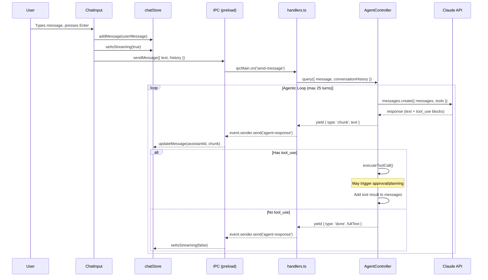
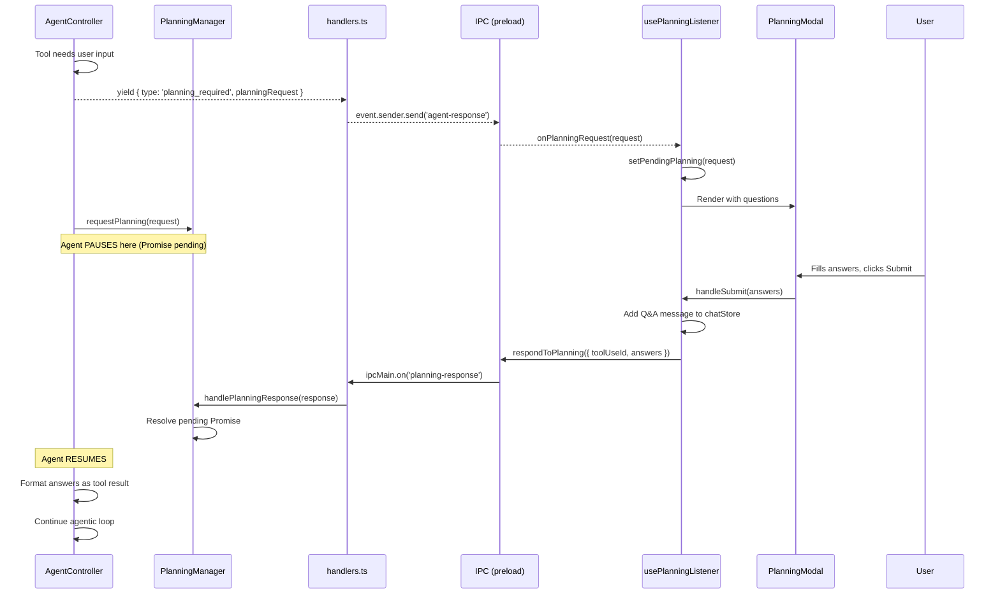
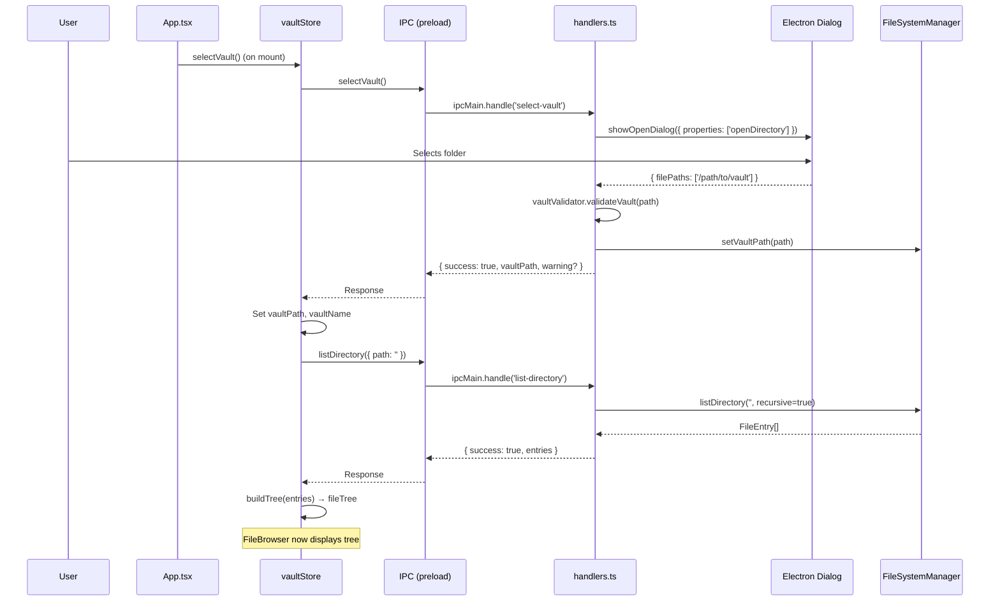
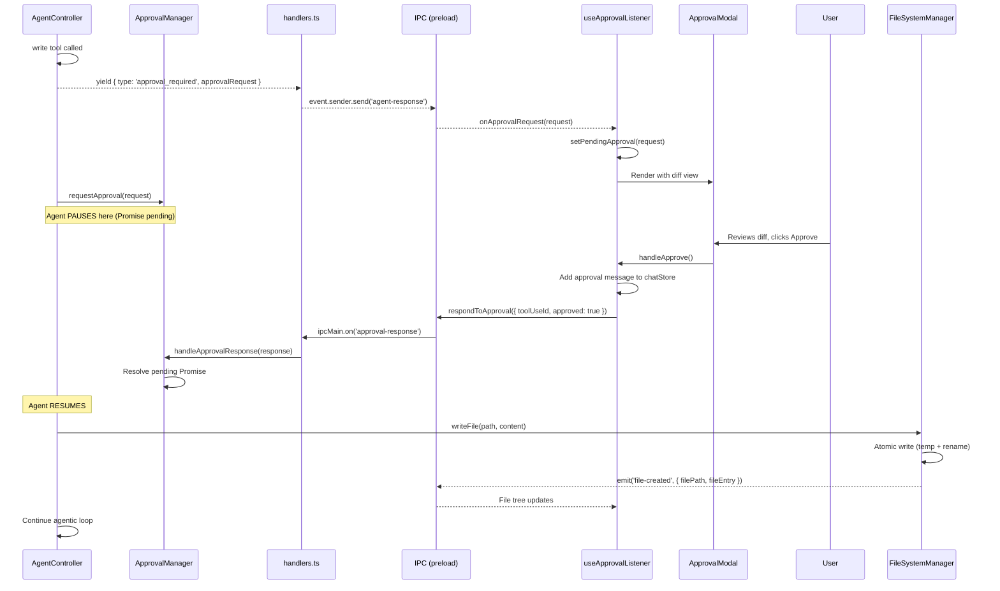

# Gary - Dungeon Master Assistant

Gary is an AI assistant designed to help Dungeon Masters for D&D 5e create rich, fun adventures. It provides an agentic workflow where Claude can read, analyze, and modify your campaign files with your approval.

## Architecture Overview

Gary is an Electron application with three main processes:

```
┌──────────────────────────────────────────────────────────────────┐
│                         ELECTRON                                 │
│  ┌─────────────────────┐    IPC    ┌──────────────────────────┐  │
│  │   Main Process      │◄─────────►│    Renderer Process      │  │
│  │                     │           │                          │  │
│  │  - AgentController  |           │  - React UI              │  │
│  │  - FileSystemManager│           │  - Zustand stores        │  │
│  │  - ApprovalManager  │           │  - User interactions     │  │
│  │  - PlanningManager  │           │                          │  │
│  │  - IPC Handlers     │           │                          │  │
│  └─────────────────────┘           └──────────────────────────┘  │
│           │                                │                     │
│           │ contextBridge                  │                     │
│           └────────────┬───────────────────┘                     │
│                  ┌─────┴─────┐                                   │
│                  │  Preload  │                                   │
│                  │  Script   │                                   │
│                  └───────────┘                                   │
└──────────────────────────────────────────────────────────────────┘
```

### Main Process Components

| Component | File | Responsibility |
|-----------|------|----------------|
| **AgentController** | `src/main/agent/AgentController.ts` | Orchestrates the agentic loop with Claude API, manages tool execution, handles turn limits and abort signals |
| **ApprovalManager** | `src/main/agent/ApprovalManager.ts` | Promise-based queue for file write approvals - pauses agent until user responds |
| **PlanningManager** | `src/main/agent/PlanningManager.ts` | Promise-based queue for planning questions - pauses agent until user answers |
| **FileSystemManager** | `src/main/vault/FileSystemManager.ts` | Atomic file I/O with security validation (paths stay in vault), emits file events |
| **FileStateTracker** | `src/main/vault/FileStateTracker.ts` | Tracks file access states for UI visualization (NOT_ACCESSED → PEEKED → READ → MODIFIED) |
| **IPC Handlers** | `src/main/ipc/handlers.ts` | Bridges all IPC communication between main and renderer |

### Renderer Process Components

| Component | File | Responsibility |
|-----------|------|----------------|
| **App** | `src/renderer/App.tsx` | Root component, sets up all IPC listeners once on mount |
| **ChatPane** | `src/renderer/components/Chat/ChatPane.tsx` | Chat UI with token counter and compact button |
| **ChatInput** | `src/renderer/components/Chat/ChatInput.tsx` | Message input with stop button during streaming |
| **ApprovalModal** | `src/renderer/components/Approval/ApprovalModal.tsx` | Side-by-side diff viewer for file write approval |
| **PlanningModal** | `src/renderer/components/Planning/PlanningModal.tsx` | Multi-question form for planning workflows |
| **chatStore** | `src/renderer/store/chatStore.ts` | Zustand store for messages, streaming state, token counting |
| **vaultStore** | `src/renderer/store/vaultStore.ts` | Zustand store for vault path, file tree, file states |

### IPC Communication

The preload script (`src/preload/preload.ts`) exposes a typed IPC API via `contextBridge`:

```typescript
interface IpcApi {
  // Message flow
  sendMessage: (payload: UserMessagePayload) => void;
  onAgentResponse: (callback: (response: AgentQueryResponse) => void) => () => void;

  // Vault operations
  selectVault: () => Promise<SelectVaultResponse>;
  listDirectory: (request: ListDirectoryRequest) => Promise<ListDirectoryResponse>;

  // Workflow responses
  respondToApproval: (response: ApprovalResponse) => void;
  respondToPlanning: (response: PlanningResponse) => void;

  // Other
  compactConversation: (request: CompactionRequest) => Promise<CompactionResponse>;
  abortQuery: () => void;

  // Event listeners
  onFileStateUpdate: (callback) => () => void;
  onFileCreated: (callback) => () => void;
  onDirectoryCreated: (callback) => () => void;
}
```

---

## User Interaction Flows

### Flow 1: User Sends a Message

This is the core interaction - user sends text, agent processes it with tools, streams response back.



### Flow 2: User Answers Planning Questions

When the agent needs user input (e.g., "What should the NPC's motivation be?"), it pauses and asks via a modal.



### Flow 3: User Selects a Vault

On app startup or when clicking "Open Vault", the user selects a directory containing their campaign files.



### Flow 4: User Approves/Rejects a File Write

When the agent wants to create or modify a file, it must get user approval first.



---

## Development

### Prerequisites
- Node.js 20+
- npm

### Setup
```bash
npm install
```

### Running in Development Mode

1. Start the dev watchers (compiles main, preload, and renderer in watch mode):
```bash
npm run dev
```

2. In a separate terminal, start Electron:
```bash
npm run start:dev
```

The Vite dev server will run on `http://localhost:5173` (or next available port if 5173 is in use).

### Building for Production

```bash
npm run build
```

This compiles all three processes:
- Main process → `dist/main/`
- Preload script → `dist/preload/`
- Renderer process → `dist/renderer/`

### Running Production Build

```bash
npm start
```

### Available Scripts

**Development:**
- `npm run dev` - Start all dev watchers (main, preload, renderer)
- `npm run start:dev` - Run Electron in development mode

**Building:**
- `npm run build` - Build all processes for production
- `npm start` - Run production build
- `npm run build:main` - Build only main process
- `npm run build:preload` - Build only preload script
- `npm run build:renderer` - Build only renderer process

**Testing:**
- `npm test` - Run tests in watch mode
- `npm run test:run` - Run tests once
- `npm run test:coverage` - Generate coverage report
- `npm run lint` - Type check all TypeScript

**Verification:**
- `npm run verify` - Run lint + tests + build (recommended before committing)
- `npm run ci` - Same as verify (for CI pipelines)

See [tests/README.md](tests/README.md) for detailed testing documentation.

## Project Structure

```
gary/
├── src/
│   ├── main/              # Electron main process
│   │   ├── index.ts       # Entry point, creates window
│   │   ├── window/        # Window management
│   │   ├── ipc/           # IPC handlers and events
│   │   ├── agent/         # AgentController, tools, managers
│   │   └── vault/         # FileSystemManager, state tracking
│   ├── preload/           # Preload scripts (contextBridge)
│   │   └── preload.ts     # Exposes IpcApi to renderer
│   ├── renderer/          # React UI
│   │   ├── App.tsx        # Root component
│   │   ├── components/    # UI components (Chat, Approval, Planning, etc.)
│   │   ├── store/         # Zustand state management
│   │   └── hooks/         # Custom hooks (useIPC, listeners, etc.)
│   └── common/            # Shared types
│       └── types/         # IPC, vault, and other type definitions
├── tests/                 # Test files mirroring src/ structure
├── dist/                  # Compiled output
└── index.html             # HTML entry point
```

## Technical Notes

### Architecture Decisions

- **Module System**: CommonJS for main/preload, ESNext for renderer
- **Build Tools**: TypeScript compiler (tsc) for main/preload, Vite for renderer
- **Security**: contextIsolation enabled, nodeIntegration disabled, contextBridge for IPC
- **State Management**: Zustand for React state
- **Agent Model**: Claude claude-sonnet-4-5-20250929 with 200k context window

### Key Design Patterns

1. **Promise-Based Workflow Pausing**: ApprovalManager and PlanningManager use Promises to pause the agent loop until user responds, then resume seamlessly.

2. **Async Generator Streaming**: `AgentController.query()` is an async generator that yields responses incrementally, enabling real-time UI updates.

3. **Atomic File Writes**: FileSystemManager writes to a temp file then renames, preventing partial writes on failure.

4. **Event-Driven UI Updates**: File creation/modification emits events that the renderer listens to, keeping the file tree in sync.

## License

MIT
